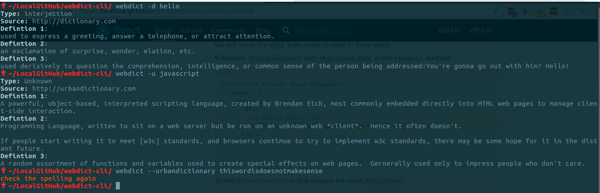

# webdict-cli

> search dictionary.com and urbandictionary from CLI

[](https://travis-ci.org/zuck007/webdict-cli) 
[](https://raw.githubusercontent.com/zuck007/webdict-cli/master/LICENSE)

## Install
```
$ npm install -g webdict-cli
```
## Usage
```
$ webdict --help
Usage: webdict [options]

  Search dictionary.com and urbandictionary from CLI

  Options:

    -h, --help                    output usage information
    -V, --version                 output the version number
    -d , --dictionary <word>      search in dictionary.com
    -u, --urbandictionary <word>  search in urbandictionary.com
```
## Screenshot

